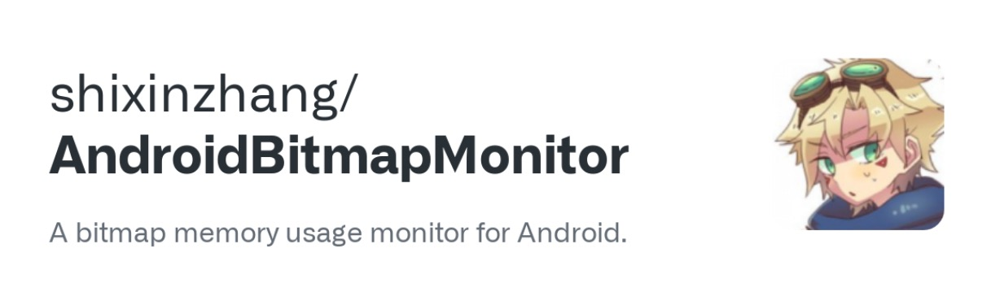
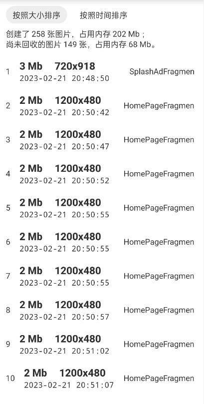
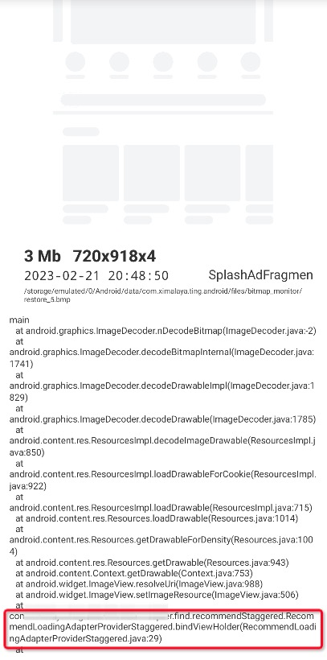

**Android Bitmap Monitor** is an Android image memory analysis tool that can help developers quickly find out whether the image usage of their apps is reasonable, supporting both offline and online usage.

[中文介绍](README_CN.md)

---

**In the memory usage of Android applications, images always occupy a large proportion.**

Take Xiaomi 12 (3200 x 1440 resolution) for example, a full screen image will take at least 17MB (3200 x 1440 x 4). If there are a few more in the cache, it will basically reach hundreds of MB, and the slightest impropriety may lead to a significant increase in memory overflow crashes of the application.

Therefore, we need a tool that can **quickly find out whether the images loaded in the application are reasonable, such as whether the size is appropriate, whether there are leaks, whether the cache is cleaned in time, whether the images that are not currently needed are loaded**, and so on.

[AndroidBitmapMonitor](https://github.com/shixinzhang/AndroidBitmapMonitor) is made for this purpose!

## Update log

| Version | Changes | Notes |
|---|---| --- |
|1.1.0|Support clearing locally saved image data to avoid taking up too much storage|Recommend|
|1.0.9|Optimize performance, reduce main thread time consumption||
|1.0.8|Fix the problem that images loaded with Glide may be solid black when restored; support no-op dependency (thanks to [yibaoshan](https://github.com/yibaoshan))||
|1.0.7|Improve the function of hover window and picture list, fix the problem that the hover window may appear more than one||

## Features

1. Support Android 4.4 - 13 (API level 19 - 33)
2. Support armeabi-v7a and arm64-v8a
3. Support offline real-time image memory view and online statistics

Functions:

1. Get the number of images in memory and how much memory they occupy
2. Get Bitmap creation stacks and threads
3. Bitmap Preview, which can be used to locate the business to which the image belongs when the stack cannot see the problem

<div align=center></div>

Screenshot of core functionality:

<div align=center></div>
<div align=center><p>Real-time view of image memory in the hover window</p></div>

<div align=center></div>
<div align=center><p>Image information in memory</p></div>

<div align=center></div>
<div align=center><p>Specific information about a particular image</p></div>

## Documentation

Use AndroidBitmapMonitor, there are four main steps:

1. Adding gradle dependencies
2. Initialize the configuration
3. Call start and stop when needed
4. Get the data

### 1.Adding dependencies in build.gradle

Android Bitmap Monitor is published on mavenCentral, so first you need to make sure your project uses mavenCentral as a repository.

You can add the following code to build.gradle or setting.gradle in the root directory.

```
allprojects {
	repositories {
		//...
		//add mavenCentral dependencies
		mavenCentral()
	}
}
```

Next, add the dependency to the business-specific build.gradle file.

```
android {
	packagingOptions {
		pickFirst 'lib/*/libshadowhook.so'
	}
}

dependencies {
   //dependencies 1, if you want to use it both online and offline, you can depend on it in the following way
   implementation 'io.github.shixinzhang:android-bitmap-monitor:1.1.0'

    // Dependency 2, if you don't want to have code running in the official package, you can depend on it in the following way
    releaseImplementation 'io.github.shixinzhang:android-bitmap-monitor-no-op:1.1.0'
    debugImplementation 'io.github.shixinzhang:android-bitmap-monitor:1.1.0'
}
```

Choose one of dependency 1 or 2.

> Note: To avoid conflicts with other libraries, pickFirst 'lib/*/libshadowhook.so' in the packagingOptions above is necessary.

After adding the dependencies and executing gradle sync, the next step is to initialize and start it in the code.

### 2. Initialization

The API to be called for initialization is ``BitmapMonitor.init``.

```
        long checkInterval = 10;
        long threshold = 100 * 1024;
        long restoreImageThreshold = 100 * 1024;;
        String dir = this.getExternalFilesDir("bitmap_monitor").getAbsolutePath();

        BitmapMonitor.Config config = new BitmapMonitor.
                .checkRecycleInterval(checkInterval)                            // check if the image is recycled interval, in seconds (recommended not too often, default 5 seconds)
                .getStackThreshold(threshold)                                   // get the threshold of the stack, when an image occupies more than this value of memory will go to grab the stack
                .restoreImageThreshold(restoreImageThreshold)                   // restore the image threshold, when a picture occupies more memory than this value, it will restore an original picture
                .restoreImageDirectory(dir)                                     // the directory of the restored image
                .showFloatWindow(true)                                          // whether to show a hover window to see the memory size in real time (recommended to open only in debug environment)
                .clearAllFileWhenRestartApp(true)                               
                .clearFileWhenOutOfThreshold(true)                              
                .diskCacheLimitBytes(100 * 1024 * 1024)                          
                .isDebug(true)
                .context(this)
                .build();
        BitmapMonitor.init(config);
```

> When showFloatWindow is true, you need to grant hover window permission when you start the app for the first time.

### 3. Turning on and off monitoring

After initialization, you can call start/stop at any time to start and stop monitoring:

```
        //start monitoring, method 1
        BitmapMonitor.start();
        
        //Start way 2, provide page to get interface, recommended to use
        BitmapMonitor.start(new BitmapMonitor.CurrentSceneProvider() {
            @Override
            public String getCurrentScene() {
                //return the current top page name
                if (sCurrentActivity ! = null) {
                    return sCurrentActivity.getClass().getSimpleName();
                }
                return null;
            }
        });
        
        //Stop monitoring
        BitmapMonitor.stop();
```

In the above code, the parameter of open method 2 is used to get the page name when the image was created, this interface can help to know in which page the large image was created. If you don't want to provide this interface, you can use open method 1.

So what do we use to turn on monitoring?

Generally there are two ways to use "global start" and "business start".

1. Global start: start as soon as app start, for understanding the image memory data during the whole APP usage
2. Business start: start when you want, which is used to understand the image memory data of special business

### 4. Get data

After initialization and monitoring, we can intercept the creation process of each image.

**Android Bitmap Monitor** provides two APIs to get the image data in memory.

1. Interval callback addListener
2. Manual fetch data use ``dumpBitmapInfo``

Interval callbacks means registering a listener, which will be called at certain intervals and can be used for real-time monitoring.

```
        BitmapMonitor.addListener(new BitmapMonitor.BitmapInfoListener() {
            @Override
            public void onBitmapInfoChanged(final BitmapMonitorData data) {
                Log.d("bitmapmonitor", "onBitmapInfoChanged: " + data);
            }
        });
```

The interval is the parameter ``checkRecycleInterva``l passed during initialization, and the returned data structure is shown below:

```
public class BitmapMonitorData {
// history of the total number of images created
public long createBitmapCount;
// history of the creation of the total image memory size, unit byte
public long createBitmapMemorySize;

    // the current number of images in memory that have not been recycled
    public long remainBitmapCount;
    // the current memory has not been recycled image memory size, unit byte
    public long remainBitmapMemorySize;

    //leakage (not released) of bitmap data
    public BitmapRecord[] remainBitmapRecords;
    
    //...
}
```

Manual fetch data use ``dumpBitmapInfo``, means actively calling ``BitmapMonitor.dumpBitmapInfo()`` to fetch all data in memory, which can be used to report data when memory is elevated.

```
        // Get all the data
        BitmapMonitorData bitmapAllData = BitmapMonitor.dumpBitmapInfo();
        Log.d("bitmapmonitor", "bitmapAllData: " + bitmapAllData);
        
        //get only the number and memory size, not the specific image information
        BitmapMonitorData bitmapCountData = BitmapMonitor.dumpBitmapCount();
        Log.d("bitmapmonitor", "bitmapCountData: " + bitmapCountData);
```

If you just want to get the total number of images and the total amount of memory, you can call dumpBitmapCount, which is faster and lighter.

Here we understand the core API of Android Bitmap Monitor, through this library we can have a deeper understanding of APP's image usage, and also make the knowledge a little wider! Come and use it!

## Contributed by

1. [shixinzhang](https://about.me/shixinzhang)
2. [yibaoshan](https://github.com/yibaoshan)

## Thanks

1. The function hook is implemented by the powerful [android-inline-hook](https://github.com/bytedance/android-inline-hook), thanks.
2. The image export is based on [Nian Sun](https://www.linkedin.cn/incareer/in/nian-sun-531b3745)'s implementation.

## Contact me

<div style="display:flex; flex-direction:row">
    
    
</div>

## License

Android Bitmap Monitor is licensed under Apache 2.0.